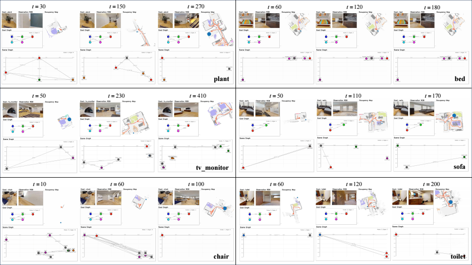

# DGR-Nav
DGR-Nav: Dual-Channel Graph Representation for Zero-Shot Goal Navigation

Zero-shot goal navigation requires an agent to search for goals specified by object categories, target images, or language descriptions without task-specific training. Existing scene-graph-based methods mainly rely on semantic relationships, while spatial structures among observed regions are often underutilized.
Inspired by the dual-stream theory of visual processing, we propose DGR-Nav, a training-free zero-shot goal navigation framework based on dual-channel graph representation.
DGR-Nav incrementally constructs a semantic `What' graph and a spatial `Where' graph from RGB-D observations. 
Object clusters are summarized as representative nodes, and semantic relations are corrected using spatial constraints to form a compact spatio-semantic graph. 
For goal exploration, DGR-Nav combines frontier distance, LLM-estimated object-goal proximity, and graph matching cues to select informative frontier targets.
Experiments on the HM3D dataset show that DGR-Nav achieves competitive performance compared with recent universal zero-shot navigation baselines.
Ablation studies further show the effectiveness of dual-channel graph construction, representative-node generation, region fusion, and LLM-guided frontier scoring. We further provide a real-world case study to examine the practical feasibility of deploying the proposed framework on a physical robot.

## Visualization

